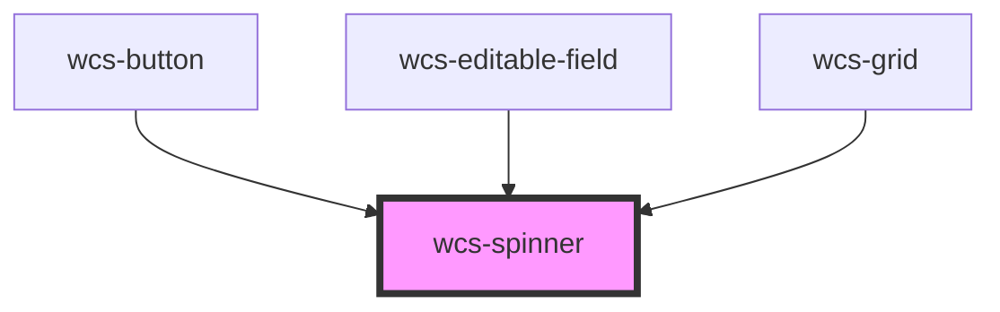

# Spinner

<!-- Auto Generated Below -->

## Properties

| Property | Attribute | Description                                                                | Type                    | Default    |
| -------- | --------- | -------------------------------------------------------------------------- | ----------------------- | ---------- |
| `mode`   | `mode`    | Indicates the spinner display mode. Accepted values: `border` or `growing` | `"border" \| "growing"` | `'border'` |

## Dependencies

### Used by

 - [wcs-button](../button)
 - [wcs-editable-field](../editable-field)
 - [wcs-grid](../grid)

### Graph

----------------------------------------------

*Built with [StencilJS](https://stenciljs.com/)*
