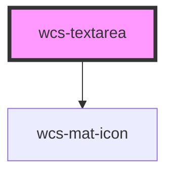

# Textarea

<!-- Auto Generated Below -->

## Overview

Mainly inspired from Ionic Textarea Component

## Properties

| Property         | Attribute        | Description                                                                                                                                                                      | Type                                                                                  | Default        |
| ---------------- | ---------------- | -------------------------------------------------------------------------------------------------------------------------------------------------------------------------------- | ------------------------------------------------------------------------------------- | -------------- |
| `autoGrow`       | `auto-grow`      | If `true`, the element height will increase based on the value.                                                                                                                  | `boolean`                                                                             | `false`        |
| `autocapitalize` | `autocapitalize` | Indicates whether and how the text value should be automatically capitalized as it is entered/edited by the user.                                                                | `string`                                                                              | `'none'`       |
| `autofocus`      | `autofocus`      | This Boolean attribute lets you specify that a form control should have input focus when the page loads.                                                                         | `boolean`                                                                             | `false`        |
| `clearOnEdit`    | `clear-on-edit`  | If `true`, the value will be cleared after focus upon edit. Defaults to `true` when `type` is `"password"`, `false` for all other types.                                         | `boolean`                                                                             | `false`        |
| `cols`           | `cols`           | The visible width of the text control, in average character widths. If it is specified, it must be a positive integer.                                                           | `number`                                                                              | `undefined`    |
| `debounce`       | `debounce`       | Set the amount of time, in milliseconds, to wait to trigger the `wcsChange` event after each keystroke. This also impacts form bindings such as `ngModel` or `v-model`.          | `number`                                                                              | `0`            |
| `disabled`       | `disabled`       | If `true`, the user cannot interact with the textarea.                                                                                                                           | `boolean`                                                                             | `false`        |
| `enterkeyhint`   | `enterkeyhint`   | A hint to the browser for which enter key to display. Possible values: `"enter"`, `"done"`, `"go"`, `"next"`, `"previous"`, `"search"`, and `"send"`.                            | `"done" \| "enter" \| "go" \| "next" \| "previous" \| "search" \| "send"`             | `undefined`    |
| `icon`           | `icon`           | Name of the material icon to add to the input                                                                                                                                    | `string`                                                                              | `undefined`    |
| `inputmode`      | `inputmode`      | A hint to the browser for which keyboard to display. Possible values: `"none"`, `"text"`, `"tel"`, `"url"`, `"email"`, `"numeric"`, `"decimal"`, and `"search"`.                 | `"decimal" \| "email" \| "none" \| "numeric" \| "search" \| "tel" \| "text" \| "url"` | `undefined`    |
| `maxlength`      | `maxlength`      | If the value of the type attribute is `text`, `email`, `search`, `password`, `tel`, or `url`, this attribute specifies the maximum number of characters that the user can enter. | `number`                                                                              | `undefined`    |
| `minlength`      | `minlength`      | If the value of the type attribute is `text`, `email`, `search`, `password`, `tel`, or `url`, this attribute specifies the minimum number of characters that the user can enter. | `number`                                                                              | `undefined`    |
| `name`           | `name`           | The name of the control, which is submitted with the form data.                                                                                                                  | `string`                                                                              | `this.inputId` |
| `placeholder`    | `placeholder`    | Instructional text that shows before the input has a value.                                                                                                                      | `string`                                                                              | `undefined`    |
| `readonly`       | `readonly`       | If `true`, the user cannot modify the value.                                                                                                                                     | `boolean`                                                                             | `false`        |
| `required`       | `required`       | If `true`, the user must fill in a value before submitting a form.                                                                                                               | `boolean`                                                                             | `false`        |
| `rows`           | `rows`           | The number of visible text lines for the control.                                                                                                                                | `number`                                                                              | `undefined`    |
| `spellcheck`     | `spellcheck`     | If `true`, the element will have its spelling and grammar checked.                                                                                                               | `boolean`                                                                             | `false`        |
| `state`          | `state`          | Specifies the state of the input. By default the input is in an initial state but you can set it to 'error' state if the data given by the user is not valid.                    | `"error" \| "initial"`                                                                | `'initial'`    |
| `value`          | `value`          | The value of the textarea.                                                                                                                                                       | `string`                                                                              | `''`           |
| `wrap`           | `wrap`           | Indicates how the control wraps text.                                                                                                                                            | `"hard" \| "off" \| "soft"`                                                           | `undefined`    |

## Events

| Event       | Description                               | Type                                     |
| ----------- | ----------------------------------------- | ---------------------------------------- |
| `wcsBlur`   | Emitted when the input loses focus.       | `CustomEvent<FocusEvent>`                |
| `wcsChange` | Emitted when the input value has changed. | `CustomEvent<TextareaChangeEventDetail>` |
| `wcsFocus`  | Emitted when the input has focus.         | `CustomEvent<FocusEvent>`                |
| `wcsInput`  | Emitted when a keyboard input occurred.   | `CustomEvent<KeyboardEvent>`             |

## Methods

### `fitContent() => Promise<void>`

This method make the textarea automatically adopt the size of the content without a scroll bar

#### Returns

Type: `Promise<void>`

### `getInputElement() => Promise<HTMLTextAreaElement>`

Returns the native `<textarea>` element used under the hood.

#### Returns

Type: `Promise<HTMLTextAreaElement>`

### `setFocus() => Promise<void>`

Sets focus on the native `textarea` in `wcs-textarea`. Use this method instead of the global
`textarea.focus()`.

#### Returns

Type: `Promise<void>`

## Dependencies

### Depends on

- [wcs-mat-icon](../mat-icon)

### Graph

----------------------------------------------

*Built with [StencilJS](https://stenciljs.com/)*
